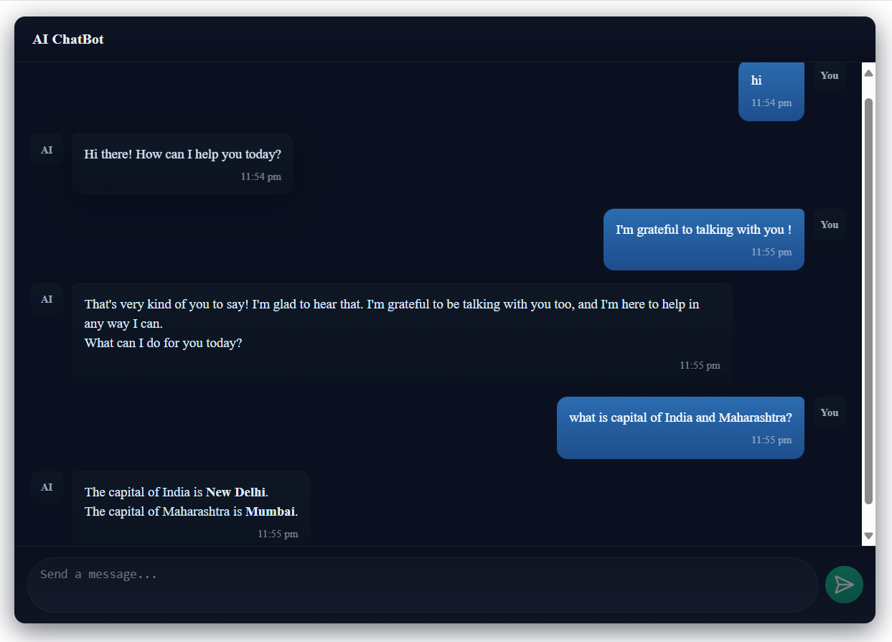

# AI ChatBot (Gemini 2.5 Flash)

A modern AI chatbot application leveraging Google's Gemini 2.5 Flash model for intelligent conversations. Built with a modern tech stack featuring React, TypeScript, and Express.



## 🌟 Features

- 💬 Real-time chat interface with modern design
- 🤖 Powered by Google's Gemini 2.5 Flash AI model
- 🎨 Sleek UI components using Shadcn UI
- 📱 Fully responsive design
- ⚡ Fast performance with Vite and Bun
- 🔒 Environment variable support for secure API key management

## 🚀 Tech Stack

### Frontend

- **React 19** - UI library
- **TypeScript** - Type safety
- **Vite** - Build tool and development server
- **Shadcn UI** - UI component library
- **Axios** - HTTP client
- **React Markdown** - Markdown rendering

### Backend

- **Express** - Node.js web framework
- **TypeScript** - Type safety
- **Bun** - JavaScript runtime and package manager
- **@google/generative-ai** - Google's Gemini AI integration
- **dotenv** - Environment variable management

## 📋 Prerequisites

- Node.js 18 or higher
- Bun runtime
- Google API key for Gemini model

## 🛠️ Installation

1. Clone the repository

```bash
git clone https://github.com/xerovanta/AI-ChatBot-by-Mayur.git
cd AI-ChatBot-by-Mayur
```

2. Install dependencies

```bash
# Root directory
bun install

# Client
cd packages/client
bun install

# Server
cd ../server
bun install
```

3. Configure environment variables

```bash
# In packages/server directory
cp .env.example .env
# Add your Google API key to .env file
GOOGLE_API_KEY=your_api_key_here
```

## 🚀 Running the Application

1. Start the server

```bash
cd packages/server
bun run dev
```

2. Start the client (in a new terminal)

```bash
cd packages/client
bun run dev
```

3. Open your browser and visit `http://localhost:5173`

## 📁 Project Structure

```
├── packages/
│   ├── client/              # Frontend React application
│   │   ├── src/
│   │   │   ├── components/  # React components
│   │   │   ├── lib/        # Utility functions
│   │   │   └── assets/     # Static assets
│   │   └── package.json
│   └── server/             # Backend Express server
│       ├── controllers/    # Request handlers
│       ├── services/      # Business logic
│       ├── repositories/  # Data access
│       └── package.json
└── package.json
```

## 🤝 Contributing

Contributions are welcome! Please feel free to submit a Pull Request.

## 📝 License

This project is licensed under the MIT License - see the [LICENSE](LICENSE) file for details.

## 👨‍💻 Author

**Mayur Neve**

- GitHub: [@xerovanta](https://github.com/xerovanta)
